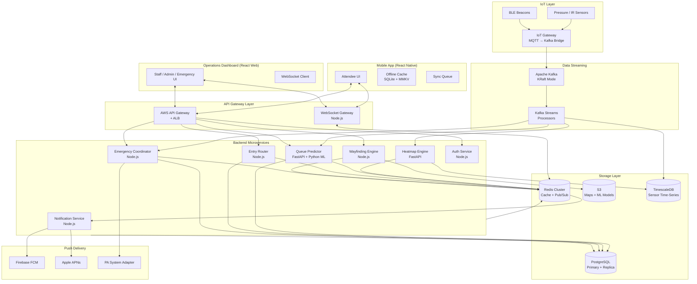
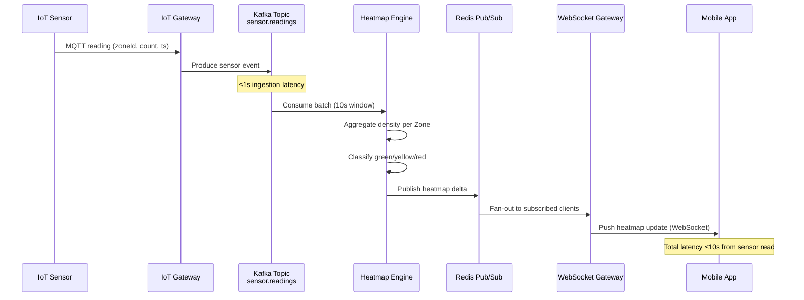

# Design Document: VenueFlow Platform

## Overview

VenueFlow is a mobile-first, AI-powered crowd management and fan experience platform for large-scale events. The system ingests real-time IoT sensor data via Apache Kafka, processes it through a set of specialized backend services, and delivers crowd density heatmaps, predictive queue times, indoor navigation, and emergency coordination to both Attendees (via a React Native mobile app) and Venue Operations Staff (via a web-based Operations Dashboard).

The platform must handle extreme scale — 500,000+ concurrent users, 500,000+ concurrent IoT sensor streams — while maintaining sub-10-second data freshness for all real-time features and providing full offline capability for core Attendee functions.

### Key Design Decisions

- **Kappa Architecture** for data processing: a single unified Kafka streaming pipeline handles both real-time and historical data, avoiding the complexity of a Lambda dual-layer approach. This simplifies the ML retraining pipeline and the heatmap engine.
- **Microservices with event-driven communication**: each subsystem (Entry_Router, Heatmap_Engine, Queue_Predictor, Wayfinding_Engine, Emergency_Coordinator) is an independently deployable service that consumes from and publishes to Kafka topics.
- **Offline-first mobile architecture**: the React Native app uses SQLite for structured local storage (maps, tickets, routes) and MMKV for fast key-value state, with a background sync queue that replays mutations on reconnect.
- **WebSocket + FCM/APNs hybrid push**: real-time updates are delivered over persistent WebSocket connections when the app is foregrounded; Firebase Cloud Messaging (FCM) and Apple Push Notification Service (APNs) are used for background/terminated app states.
- **Multi-region active/passive on AWS**: primary region handles all live traffic; a warm standby region receives continuous data replication and can accept traffic within 10 seconds of a primary failure via Route 53 health-check failover.

---

## Architecture

### High-Level System Diagram



### Data Flow: IoT Sensor → Attendee Heatmap



---

## Components and Interfaces

### 1. IoT Gateway

Bridges physical sensors to Kafka. Sensors publish via MQTT; the gateway translates to Kafka producer events.

**Kafka Topic Schema** (`sensor.readings`):
```json
{
  "sensorId": "string",
  "zoneId": "string",
  "venueId": "string",
  "count": "integer",
  "timestamp": "ISO8601",
  "sensorType": "pressure | ir | ble"
}
```

**Sensor failure detection**: a Kafka Streams processor monitors per-sensor heartbeat intervals. If no event is received within the configured interval (default 30s), it emits a `sensor.failures` event consumed by the Heatmap Engine and Operations Dashboard.

### 2. Heatmap Engine (FastAPI)

Consumes `sensor.readings` via Kafka Streams, aggregates density per Zone over a 10-second tumbling window, classifies zones, and publishes updates.

**REST Endpoints:**
- `GET /heatmap/{venueId}` — returns current zone density snapshot
- `GET /heatmap/{venueId}/zones/{zoneId}` — returns single zone state

**Internal Processing:**
```
sensor.readings → [10s tumbling window] → zone aggregation → density classification → Redis PUBLISH heatmap:{venueId}
```

**Zone State Model:**
```
AVAILABLE (green | yellow | red) | UNAVAILABLE (no data >30s)
```

### 3. Entry Router (Node.js)

Assigns Attendees to optimal entry gates based on current zone density and historical throughput data.

**REST Endpoints:**
- `GET /entry/recommendation/{attendeeId}` — returns recommended gate + predicted wait time
- `POST /entry/scan` — validates QR ticket, records entry event
- `POST /entry/face-scan` — processes face-scan entry (biometric data discarded post-validation)

**Gate Recommendation Algorithm:**
1. Fetch current density for all entry gate zones from Redis
2. Score gates: `score = (current_queue_length / gate_capacity) + (distance_weight * attendee_distance)`
3. Return gate with lowest score
4. Recalculate every 10 seconds; push revised recommendation via WebSocket if assigned gate becomes Red_Zone

**Offline QR Validation:**
- QR tickets are signed JWTs (RS256) with event ID, seat, and expiry
- Mobile app validates signature locally using the venue's public key (cached pre-event)
- Gate scanner devices also cache the public key for offline validation
- Entry events are queued locally and synced to backend on reconnect

### 4. Queue Predictor (FastAPI + Python ML)

Generates wait time predictions for all Kiosks, restrooms, and exits every 60 seconds.

**Model Architecture:**
- Primary model: XGBoost regressor trained on historical event data + real-time IoT density features
- Features: current zone density, time-of-day, event phase (pre-show, halftime, post-show), historical throughput at same event type
- Fallback model: exponential moving average of recent observed wait times when ML model confidence is low
- Target accuracy: MAPE < 15% (>85% accuracy)

**REST Endpoints:**
- `GET /queues/{venueId}` — returns all current predictions
- `GET /queues/{venueId}/kiosk/{kioskId}` — single kiosk prediction
- `GET /queues/{venueId}/kiosk/{kioskId}/alternatives` — nearest kiosks with shorter wait

**Prediction Pipeline:**
```
[60s timer] → fetch zone densities from Redis → run XGBoost inference → store predictions in Redis → publish to queue.predictions Kafka topic
```

### 5. Wayfinding Engine (Node.js)

Computes indoor navigation routes using Mapbox Indoor SDK and BLE beacon positioning.

**REST Endpoints:**
- `POST /navigate` — body: `{from: Location, to: Destination, accessibility: boolean}` → returns route
- `POST /navigate/recalculate` — recalculates route avoiding current Red_Zones

**Location Resolution:**
1. Primary: BLE beacon trilateration (RSSI-based positioning, ±3m accuracy)
2. Fallback: last known map position + dead reckoning via device accelerometer
3. If BLE unavailable: map-based navigation without blue-dot positioning

**Route Computation:**
- Graph-based shortest path (Dijkstra) on venue floor graph
- Red_Zone nodes are assigned infinite weight, forcing route around them
- Accessibility mode: edges with stairs are removed from the graph
- Route recalculation triggered when: (a) Attendee deviates >10m from route, or (b) a zone on the route becomes Red_Zone

**Offline Map Delivery:**
- Venue maps are pre-packaged as Mapbox offline tile packs + a JSON graph file
- Downloaded to device during pre-event sync (triggered 2 hours before event start)
- Emergency exit routes are a separate lightweight JSON payload cached independently

### 6. Emergency Coordinator (Node.js)

Manages SOS signals, evacuation route distribution, and PA system integration.

**REST Endpoints:**
- `POST /emergency/sos` — Attendee SOS submission
- `POST /emergency/evacuate` — Emergency_Team initiates zone or full-venue evacuation
- `GET /emergency/status/{venueId}` — current evacuation state

**SOS Flow:**
```
Attendee taps SOS → POST /emergency/sos → store in PostgreSQL → publish to emergency.sos Kafka topic → 
Notification Service pushes to Operations Dashboard WebSocket → Dashboard alert within 5s
```

**Evacuation Flow:**
```
Emergency_Team triggers evacuation → POST /emergency/evacuate → 
  ├── Notification Service: FCM/APNs mass push to all Zone Attendees (≤10s)
  ├── PA Adapter: HTTP call to PA system API (≤15s)
  └── Heatmap Engine: switch to evacuation bottleneck mode
```

**Offline Evacuation:**
- Pre-loaded emergency exit routes (JSON) are stored in device SQLite at pre-event sync
- If app is offline during evacuation, the cached routes are displayed automatically
- Routes are keyed by zone ID so the correct exits are shown based on last known zone

**Audit Log:**
- All SOS signals, evacuation orders, and PA triggers are written to an append-only `emergency_audit` PostgreSQL table with timestamps, actor IDs, and zone IDs

### 7. Notification Service (Node.js)

Centralizes all push delivery: WebSocket fan-out for foregrounded apps, FCM/APNs for background/terminated.

**Delivery Strategy:**
- Foregrounded app: WebSocket message via Redis pub/sub fan-out
- Background/terminated: FCM (Android) / APNs (iOS) silent push → app wakes, fetches update
- Emergency broadcasts: both channels simultaneously for maximum delivery guarantee

**WebSocket Gateway:**
- Clients subscribe to channels: `heatmap:{venueId}`, `alerts:{attendeeId}`, `emergency:{venueId}`
- Horizontal scaling via Redis pub/sub: any gateway node can publish to any connected client
- Connection state stored in Redis with TTL

### 8. Auth Service (Node.js)

JWT-based authentication with role-based access control.

**Roles:** `ATTENDEE`, `STAFF`, `ADMIN`, `EMERGENCY`

**Endpoints:**
- `POST /auth/login` — returns access token (15min) + refresh token (7 days)
- `POST /auth/refresh` — rotates tokens
- `DELETE /auth/account` — GDPR account deletion (soft-delete + anonymization)

### 9. Operations Dashboard (React Web)

Real-time web interface for Venue_Operations_Staff, Venue_Admin, and Emergency_Team.

**Key Views:**
- Live heatmap with zone headcounts (10s refresh via WebSocket)
- Gate entry/exit flow rates (10s refresh)
- Anomaly alert panel with staff deployment recommendations
- Emergency control panel (SOS list, evacuation trigger, PA trigger)
- Venue configuration (zone editor, threshold settings, sensor mapping)
- Post-event analytics reports

**Role-Based Access:**
| Feature | STAFF | ADMIN | EMERGENCY |
|---|---|---|---|
| View heatmap | ✓ | ✓ | ✓ |
| Trigger evacuation | — | — | ✓ |
| Configure venue | — | ✓ | — |
| View analytics | ✓ | ✓ | — |
| Manage staff | — | ✓ | — |

### 10. Mobile App (React Native)

**Offline-First Architecture:**
- SQLite (via `expo-sqlite`): venue maps (graph JSON), navigation routes, emergency exits, event schedule
- MMKV: fast key-value store for current zone state, QR ticket JWT, user preferences
- Sync Queue: a SQLite table of pending mutations (entry events, SOS signals) replayed on reconnect
- Background sync: triggered by `NetInfo` connectivity change event; completes within 30 seconds

**Pre-Event Sync Checklist** (triggered 2 hours before event):
1. Download venue map tile pack (Mapbox offline)
2. Download venue graph JSON (for route computation)
3. Cache QR ticket JWT
4. Cache emergency exit routes JSON
5. Cache venue public key (for offline QR validation)

---

## Data Models

### Zone
```typescript
interface Zone {
  zoneId: string;           // UUID
  venueId: string;
  name: string;
  floorLevel: number;
  polygon: GeoJSON.Polygon; // geographic boundary
  capacity: number;         // max safe occupancy
  redZoneThreshold: number; // density % that triggers Red_Zone
  sensorIds: string[];      // assigned IoT sensors
  isAccessible: boolean;    // wheelchair accessible
}
```

### ZoneDensitySnapshot
```typescript
interface ZoneDensitySnapshot {
  zoneId: string;
  venueId: string;
  currentCount: number;
  densityPercent: number;   // currentCount / capacity
  status: 'green' | 'yellow' | 'red' | 'unavailable';
  lastUpdated: Date;
  dataAvailable: boolean;   // false if sensor silent >30s
}
```

### SensorReading (Kafka event)
```typescript
interface SensorReading {
  sensorId: string;
  zoneId: string;
  venueId: string;
  count: number;
  timestamp: string;        // ISO8601
  sensorType: 'pressure' | 'ir' | 'ble';
}
```

### QueuePrediction
```typescript
interface QueuePrediction {
  locationId: string;       // kioskId | restroomId | exitId
  locationType: 'kiosk' | 'restroom' | 'exit';
  venueId: string;
  predictedWaitMinutes: number;
  confidenceScore: number;  // 0-1
  generatedAt: Date;
  modelVersion: string;
}
```

### NavigationRoute
```typescript
interface NavigationRoute {
  routeId: string;
  fromLocation: Location;
  toDestination: string;
  steps: RouteStep[];
  totalDistanceMeters: number;
  estimatedMinutes: number;
  avoidedZones: string[];   // Red_Zone IDs avoided
  isAccessible: boolean;
  generatedAt: Date;
}

interface RouteStep {
  instruction: string;      // "Turn left at Gate B"
  distanceMeters: number;
  beaconId?: string;        // nearest BLE beacon for AR anchor
  floorLevel: number;
}
```

### EmergencyEvent
```typescript
interface EmergencyEvent {
  eventId: string;          // UUID
  venueId: string;
  type: 'sos' | 'evacuation' | 'pa_trigger';
  initiatorId: string;      // attendeeId or staffId
  zoneId: string;
  timestamp: Date;
  status: 'active' | 'resolved';
  metadata: Record<string, unknown>;
}
```

### AttendeeTicket
```typescript
interface AttendeeTicket {
  ticketId: string;
  attendeeId: string;
  eventId: string;
  seatSection: string;
  seatRow: string;
  seatNumber: string;
  qrPayload: string;        // signed JWT
  entryRecorded: boolean;
  entryTimestamp?: Date;
  entryGateId?: string;
}
```

### User / Auth
```typescript
interface User {
  userId: string;
  email: string;            // hashed for storage
  role: 'ATTENDEE' | 'STAFF' | 'ADMIN' | 'EMERGENCY';
  venueId?: string;         // for staff/admin
  locationConsentGiven: boolean;
  deletedAt?: Date;         // soft delete for GDPR
}
```

---

## Correctness Properties

*A property is a characteristic or behavior that should hold true across all valid executions of a system — essentially, a formal statement about what the system should do. Properties serve as the bridge between human-readable specifications and machine-verifiable correctness guarantees.*


### Property 1: Gate Recommendation Completeness

*For any* valid venue state with at least one active entry gate, the Entry_Router's recommendation response must contain a valid gateId and a non-negative predictedWaitMinutes value.

**Validates: Requirements 1.1**

---

### Property 2: Offline QR Validation Correctness

*For any* QR ticket JWT signed with the venue's private key, the offline validator must accept it; and for any JWT that has been tampered with, has an invalid signature, or has expired, the offline validator must reject it.

**Validates: Requirements 1.3**

---

### Property 3: Red_Zone Gate Reassignment

*For any* Attendee assigned to gate G, if G transitions to Red_Zone status, the Entry_Router's updated recommendation must return a gate other than G.

**Validates: Requirements 1.5**

---

### Property 4: No Biometric Data Post-Entry

*For any* entry event processed (whether via QR scan or face-scan), after the entry event is recorded, querying the database for biometric data associated with that entry must return no results.

**Validates: Requirements 1.8, 9.1**

---

### Property 5: Zone Density Classification Monotonicity

*For any* two density percentage values D1 < D2, the zone status classification of D1 must be less than or equal in severity to the classification of D2 (i.e., the mapping from density to green/yellow/red must be monotonically non-decreasing in severity).

**Validates: Requirements 2.3**

---

### Property 6: Stale Sensor Data Marking

*For any* zone whose last sensor reading timestamp is more than 30 seconds in the past, the zone's status in the heatmap must be "unavailable" rather than green, yellow, or red.

**Validates: Requirements 2.7**

---

### Property 7: Red_Zone Notification Dispatch

*For any* zone Z that transitions to Red_Zone status, the notification dispatch must include all Attendees whose last known zone is Z or is adjacent to Z.

**Validates: Requirements 2.4**

---

### Property 8: Queue Prediction Availability

*For any* active location ID (kiosk, restroom, or exit), the Queue_Predictor must return a prediction response containing a non-negative predictedWaitMinutes value.

**Validates: Requirements 3.2**

---

### Property 9: Alternative Kiosk Suggestion

*For any* kiosk K whose predictedWaitMinutes exceeds 10, the suggested alternative kiosk must have a strictly shorter predicted wait time than K.

**Validates: Requirements 3.5**

---

### Property 10: Route Completeness

*For any* pair of nodes (source, destination) that are connected in the venue floor graph, the Wayfinding_Engine must return a non-empty route containing at least one step.

**Validates: Requirements 4.1**

---

### Property 11: Red_Zone Route Avoidance

*For any* route R that passes through zone Z, if Z transitions to Red_Zone status and the route is recalculated, the new route must not contain any node belonging to zone Z (provided an alternative path exists in the graph).

**Validates: Requirements 4.2**

---

### Property 12: Accessibility Route Constraint

*For any* route computed with accessibility mode enabled, no RouteStep in the result may traverse an edge that is marked as stairs or non-accessible in the venue graph.

**Validates: Requirements 4.4**

---

### Property 13: Offline Cache Round-Trip

*For any* app that has completed a pre-event sync, the following items must be retrievable from local storage without a network connection and must match what was downloaded: venue map graph, QR ticket JWT, and emergency exit routes.

**Validates: Requirements 5.6, 10.1, 10.3, 10.5**

---

### Property 14: Emergency Audit Log Completeness

*For any* emergency event submitted (SOS signal, evacuation order, or PA trigger), the emergency audit log must contain an entry with a matching eventId, the correct event type, and a non-null timestamp recorded at or before the event was processed.

**Validates: Requirements 5.7**

---

### Property 15: Anomaly Alert and Deployment Recommendation

*For any* zone Z with a configured danger threshold T, if Z's current density exceeds T, then both an anomaly alert for Z and a staff deployment recommendation referencing Z must be generated.

**Validates: Requirements 6.3, 6.4**

---

### Property 16: Role-Based Access Control

*For any* (role, function) pair, the access control check must return authorized if and only if the function is in the role's defined permission set; no role may access a function outside its authorized set.

**Validates: Requirements 6.5**

---

### Property 17: Heatmap Anonymization

*For any* heatmap snapshot or crowd analytics output produced by the Heatmap_Engine, the data must contain only zone-level aggregate counts and must not contain any field that could identify or track an individual Attendee.

**Validates: Requirements 7.5, 9.2**

---

### Property 18: Location Consent Gate

*For any* invocation of a navigation or zone-based alert feature, if the Attendee has not explicitly granted location consent, the system must not access or transmit the Attendee's location data.

**Validates: Requirements 9.4**

---

### Property 19: Offline Route Equivalence

*For any* source/destination pair and a cached venue graph, the route computed in offline mode must be equivalent (same sequence of nodes) to the route computed in online mode using the same graph snapshot.

**Validates: Requirements 10.2**

---

## Error Handling

### IoT Sensor Failures
- **Sensor silence >30s**: Heatmap_Engine marks zone as "unavailable"; Operations_Dashboard shows warning indicator; no stale density data is displayed.
- **Kafka consumer lag**: if a consumer falls behind by >5s, an alert is raised to the ops team; the consumer auto-restarts via Kubernetes liveness probe.
- **Kafka broker failure**: Kafka is deployed with a replication factor of 3 and min.insync.replicas=2; producer retries with exponential backoff (max 3 retries, 1s/2s/4s).

### Mobile App Connectivity
- **Network loss**: app detects via `NetInfo`; switches to offline mode immediately; queues mutations in SQLite sync queue.
- **Reconnect**: sync queue is replayed in order; conflicts resolved by server-wins strategy (server state is authoritative for heatmap/routes; client wins for pending entry events).
- **Pre-event sync failure**: if sync fails, app retries every 30 seconds; user is shown a warning if sync has not completed 30 minutes before event start.

### Backend Service Failures
- **Service unavailable**: AWS ALB health checks remove unhealthy instances within 10 seconds; Route 53 health checks trigger cross-region failover within 10 seconds.
- **Database connection failure**: services use connection pooling (pg-pool); on connection failure, requests are retried up to 3 times with 500ms backoff before returning 503.
- **Redis failure**: services fall back to direct PostgreSQL reads for critical paths (heatmap snapshot, gate recommendations); non-critical features (push notifications) degrade gracefully.

### Emergency Scenarios
- **SOS submission failure**: client retries SOS POST up to 5 times with 1s intervals; if all fail, the SOS is queued locally and submitted on reconnect.
- **Evacuation push delivery failure**: FCM/APNs delivery failures are logged; the Notification Service retries failed deliveries up to 3 times; undelivered notifications are tracked in the audit log.
- **PA system unreachable**: Emergency_Coordinator logs the failure and alerts the Operations_Dashboard; staff are notified to use manual PA controls.

### Entry Validation
- **Offline QR validation failure** (invalid signature): gate scanner displays "INVALID TICKET" and logs the attempt; no entry is recorded.
- **Duplicate scan**: entry events are idempotent by ticketId; a second scan of the same ticket returns "ALREADY ENTERED" without creating a duplicate record.

---

## Testing Strategy

### Unit Tests
Focus on specific examples, edge cases, and error conditions for pure logic components:
- Entry_Router gate scoring algorithm with known density inputs
- Zone density classification thresholds (boundary values: exactly at green/yellow boundary, exactly at yellow/red boundary)
- JWT validation logic (valid token, expired token, tampered signature, wrong venue)
- Route graph algorithm with small known graphs
- Sync queue replay ordering and conflict resolution logic
- Audit log entry creation for each emergency event type
- RBAC permission matrix for all role/function combinations

### Property-Based Tests
Verify universal properties across randomly generated inputs. Uses **fast-check** (TypeScript/Node.js) for backend services and **Hypothesis** (Python) for ML/FastAPI services. Each property test runs a minimum of **100 iterations**.

Each test is tagged with:
`// Feature: venueflow-platform, Property {N}: {property_text}`

| Property | Test Target | Library |
|---|---|---|
| P1: Gate recommendation completeness | Entry Router service | fast-check |
| P2: Offline QR validation correctness | JWT validator module | fast-check |
| P3: Red_Zone gate reassignment | Entry Router service | fast-check |
| P4: No biometric data post-entry | Entry Router + DB layer | fast-check |
| P5: Zone density classification monotonicity | Heatmap Engine classifier | fast-check |
| P6: Stale sensor data marking | Heatmap Engine staleness checker | fast-check |
| P7: Red_Zone notification dispatch | Notification Service | fast-check |
| P8: Queue prediction availability | Queue Predictor service | Hypothesis |
| P9: Alternative kiosk suggestion | Queue Predictor service | Hypothesis |
| P10: Route completeness | Wayfinding Engine router | fast-check |
| P11: Red_Zone route avoidance | Wayfinding Engine router | fast-check |
| P12: Accessibility route constraint | Wayfinding Engine router | fast-check |
| P13: Offline cache round-trip | Mobile App sync module | fast-check |
| P14: Emergency audit log completeness | Emergency Coordinator | fast-check |
| P15: Anomaly alert and deployment recommendation | Dashboard alert service | fast-check |
| P16: Role-based access control | Auth Service RBAC module | fast-check |
| P17: Heatmap anonymization | Heatmap Engine output | fast-check |
| P18: Location consent gate | Mobile App location module | fast-check |
| P19: Offline route equivalence | Wayfinding Engine (offline mode) | fast-check |

### Integration Tests
Verify end-to-end behavior across service boundaries with real infrastructure (test environment):
- Kafka ingestion latency: sensor event → heatmap update ≤10s
- SOS signal delivery: submission → dashboard alert ≤5s
- Evacuation push: trigger → FCM delivery ≤10s
- Sensor failure detection: sensor silence → failure event ≤30s
- Auto-scaling: load >80% capacity → new instances healthy
- Failover: kill primary service → requests routed to healthy instance ≤10s
- Offline sync: go offline → make changes → reconnect → sync ≤30s

### Smoke Tests
Verify configuration and infrastructure setup:
- Kafka topic retention policy ≥7 days
- TLS 1.2+ on all API endpoints
- AES-256 encryption on database volumes
- ML model accuracy: MAPE <15% on held-out historical dataset
- Kafka throughput: 500k concurrent sensor streams without consumer lag
- Load test: 500k concurrent users, p95 heatmap load ≤5s on 4G LTE
